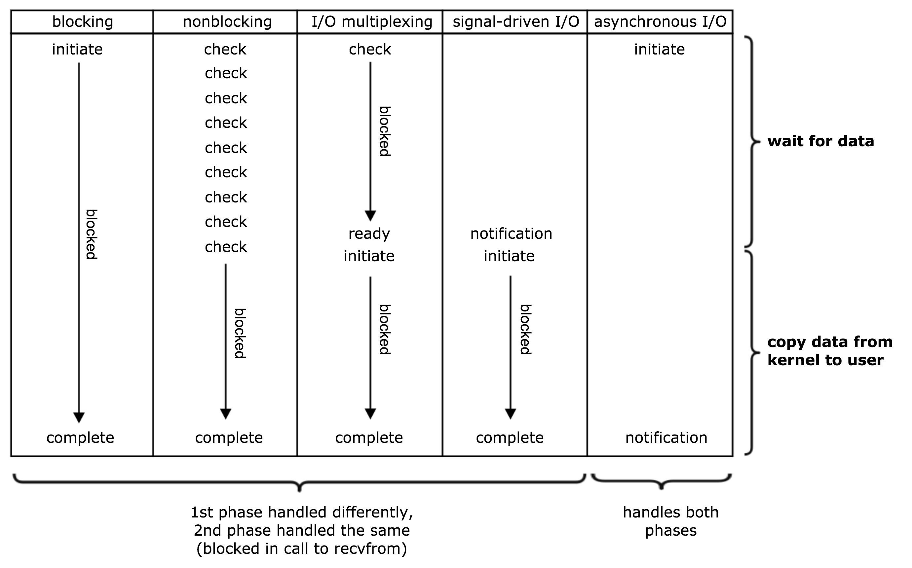

# 关于IO的基本概念

## 同步、异步、阻塞、非阻塞
对于一次IO访问（以read举例），数据会先被拷贝到操作系统内核的缓冲区中，然后才会从操作系统内核的缓冲区拷贝到应用程序的地址空间。当一个read操作发生时，它会经历两个阶段：
1. 等待数据准备 (Waiting for the data to be ready)
2. 将数据从内核拷贝到进程中 (Copying the data from the kernel to the process)

基本概念
- **阻塞**：调用者因期待的某些事件（如请求系统资源失败、等待某种操作的完成、新数据尚未到达或无新工作做等）未发生，会被挂起（投入到睡眠状态，直到数据可用时被唤醒），CPU会调度别的进程（线程）工作；
- **同步**：发起IO请求的线程不从正在调用的IO操作函数返回（即被阻塞，第2步过程中肯定阻塞）；
- **异步**：发起IO请求的线程不等IO操作完成，就继续执行随后的代码，IO结果用其他方式通知发起IO请求的程序；

如下图所示，对unix来讲：阻塞式I/O(默认)、非阻塞式I/O(nonblock)、I/O复用(select/poll/epoll)都属于同步I/O，因为它们在数据由内核空间复制回进程缓冲区时都是阻塞的(不能干别的事)。只有异步I/O模型(AIO)是符合异步I/O操作的含义的，即在1数据准备完成、2由内核空间拷贝回缓冲区后通知进程，在等待通知的这段时间里可以干别的事。


## 多路复用I/O模型
由于非阻塞调用的过程中，论询占据了大部分的过程，所以论询会占据大量的CPU时间。如果论询不是进程的用户态，而是有人帮忙就好了。多路复用正好处理这样的问题。

I/O多路复用是指内核一旦发现进程指定的一个或者多个IO条件准备读取，它就通知该进程。 IO多路复用适用如下场合： 当客户处理多个描述符时（一般是交互式输入和网络套接口），必须使用I/O复用。

### select
```c
int select (int n, fd_set *readfds, fd_set *writefds, fd_set *exceptfds, struct timeval *timeout);
```
select 函数监视的文件描述符分3类，分别是writefds、readfds、和exceptfds。调用后select函数会阻塞，直到有描述符就绪（有数据 可读、可写、或者有except），或者超时（timeout指定等待时间，如果立即返回设为null即可），函数返回。当select函数返回后，可以通过遍历fdset，来找到就绪的描述符。

select目前几乎在所有的平台上支持，其良好跨平台支持也是它的一个优点。
select的缺点：
- 在于单个进程能够监视的文件描述符的数量存在最大限制，在Linux上一般为1024，可以通过修改宏定义甚至重新编译内核的方式提升这一限制，但是这样也会造成效率的降低。
- 对socket进行扫描时是线性扫描，即采用轮询的方法，效率较低。当套接字比较多的时候，每次select()都要通过遍历FD_SETSIZE个Socket来完成调度，不管哪个Socket是活跃的，都遍历一遍。这会浪费很多CPU时间。
- 需要维护一个用来存放大量fd的数据结构，这样会使得用户空间和内核空间在传递该结构时复制开销大。

### poll
```c
int poll (struct pollfd *fds, unsigned int nfds, int timeout);
struct pollfd {
  int fd; /* file descriptor */
  short events; /* requested events to watch */
  short revents; /* returned events witnessed */
}; 
```
不同与select使用三个位图来表示三个fdset的方式，poll使用一个pollfd的指针实现。pollfd结构包含了要监视的event和发生的event，不再使用select“参数-值”传递的方式。同时，pollfd并没有最大数量限制，原因是它是基于链表来存储的，但是数量过大后性能也是会下降。和select函数一样，poll返回后，需要轮询pollfd来获取就绪的描述符。

poll本质上和select没有区别，它将用户传入的数组拷贝到内核空间，然后查询每个fd对应的设备状态，如果设备就绪则在设备等待队列中加入一项并继续遍历，如果遍历完所有fd后没有发现就绪设备，则挂起当前进程，直到设备就绪或者主动超时，被唤醒后它又要再次遍历fd。这个过程经历了多次无谓的遍历。事实上，同时连接的大量客户端在一时刻可能只有很少的处于就绪状态，因此随着监视的描述符数量的增长，其效率也会线性下降。
poll的缺点：
- 大量的fd的数组被整体复制于用户态和内核地址空间之间，而不管这样的复制是不是有意义。
- poll还有一个特点是“水平触发”，如果报告了fd后，没有被处理，那么下次poll时会再次报告该fd。

### epoll
epoll是在2.6内核中提出的，是之前的select和poll的增强版本。相对于select和poll来说，epoll更加灵活，没有描述符限制。epoll使用一个文件描述符管理多个描述符，将用户关系的文件描述符的事件存放到内核的一个事件表中，这样在用户空间和内核空间的copy只需一次。epoll的优点：
- 没有最大并发连接的限制，能打开的FD的上限远大于1024（1G的内存上能监听约10万个端口）。
- 效率提升，不是轮询的方式，不会随着FD数目的增加效率下降。只有活跃可用的FD才会调用callback函数；即epoll最大的优点就在于它只管你“活跃”的连接，而跟连接总数无关，因此在实际的网络环境中，epoll的效率就会远远高于select和poll。
- 内存拷贝，利用mmap()文件映射内存加速与内核空间的消息传递；即epoll使用mmap减少复制开销。

#### epoll操作过程
epoll操作过程需要三个接口，分别如下： 
```c
int epoll_create(int size); //创建一个epoll的句柄，size用来告诉内核这个监听的数目一共有多大
int epoll_ctl(int epfd, int op, int fd, struct epoll_event *event);
int epoll_wait(int epfd, struct epoll_event *events, int maxevents, int timeout);
struct epoll_event {
  __uint32_t events; /* Epoll events */
  epoll_data_t data; /* User data variable */
}; 
```
1. `int epoll_create(int size);` 创建一个epoll的句柄，size用来告诉内核这个监听的数目一共有多大，这个参数不同于select()中的第一个参数，给出最大监听的fd+1的值，参数size并不是限制了epoll所能监听的描述符最大个数，只是对内核初始分配内部数据结构的一个建议。当创建好epoll句柄后，它就会占用一个fd值，在linux下如果查看/proc/进程id/fd/，是能够看到这个fd的，所以在使用完epoll后，必须调用close()关闭，否则可能导致fd被耗尽。
> 在linux 2.6.8之前的内核，epoll使用hash来组织fds集合，于是在创建epoll fd的时候，epoll需要初始化hash的大小。于是epoll_create(int size)有一个参数size，以便内核根据size的大小来分配hash的大小。在linux 2.6.8以后的内核中，epoll使用红黑树来组织监控的fds集合，所以参数size实际上已经没有意义了。
2. `int epoll_ctl(int epfd, int op, int fd, struct epoll_event *event);` 函数是对指定描述符fd执行op操作。
   - epfd：是epoll_create()的返回值。
   - op：表示op操作，用三个宏来表示：添加EPOLL_CTL_ADD，删除EPOLL_CTL_DEL，修改EPOLL_CTL_MOD。分别添加、删除和修改对fd的监听事件。
   - fd：是需要监听的fd（文件描述符）
   - epoll_event：是告诉内核需要监听什么事，events可以是以下几个宏的集合：
     - `EPOLLIN`：表示对应的文件描述符可以读（包括对端SOCKET正常关闭）；
     - `EPOLLOUT`：表示对应的文件描述符可以写；
     - `EPOLLPRI`：表示对应的文件描述符有紧急的数据可读（这里应该表示有带外数据到来）；
     - `EPOLLERR`：表示对应的文件描述符发生错误；
     - `EPOLLHUP`：表示对应的文件描述符被挂断；
     - `EPOLLET`： 将EPOLL设为边缘触发(Edge Triggered)模式，这是相对于水平触发(Level Triggered)来说的。
     - `EPOLLONESHOT`：只监听一次事件，当监听完这次事件之后，如果还需要继续监听这个socket的话，需要再次把这个socket加入到EPOLL队列里
3. `int epoll_wait(int epfd, struct epoll_event *events, int maxevents, int timeout);` 等待epfd上的io事件，最多返回maxevents个事件。
   - events用来从内核得到事件的集合，
   - maxevents告之内核这个events有多大，这个maxevents的值不能大于创建epoll_create()时的size，
   - timeout是超时时间（毫秒，0会立即返回，-1将不确定，也有说法说是永久阻塞）
   - 该函数返回需要处理的事件数目，如返回0表示已超时。

#### epoll工作模式
主要实现逻辑：
- epoll引入了一个中间层，一个双向链表ready_list，一个单独的睡眠队列single_epoll_wait_list。
- Process（应用）只是插入到中间层的epoll的单独睡眠队列中（即single_epoll_wait_list），Process睡眠在epoll的单独队列上，等待事件的发生。
- 同时引入一个中间的wait_entry_sk，wait_entry_sk睡眠在socket的睡眠队列上，其callback函数逻辑是将当前socket排入到epoll的ready_list中，并唤醒epoll的single_epoll_wait_list。
- single_epoll_wait_list上睡眠的Process的回调函数：遍历ready_list上的所有socket，挨个调用socket的poll函数收集事件，然后唤醒Process从epoll_wait返回。

epoll对文件描述符的操作有两种模式：LT（level trigger）和ET（edge trigger）。LT模式是默认模式，LT模式与ET模式的区别如下：
- LT模式：当epoll_wait检测到描述符事件发生并将此事件通知应用程序，应用程序可以不立即处理该事件。下次调用epoll_wait时，会再次响应应用程序并通知此事件。
- ET模式：当epoll_wait检测到描述符事件发生并将此事件通知应用程序，应用程序必须立即处理该事件。如果不处理，下次调用epoll_wait时，不会再次响应应用程序并通知此事件。

LT模式 LT(level triggered)是缺省的工作方式，并且同时支持block和no-block socket.在这种做法中，内核告诉你一个文件描述符是否就绪了，然后你可以对这个就绪的fd进行IO操作。如果你不作任何操作，内核还是会继续通知你的。

ET模式 ET(edge-triggered)是高速工作方式，只支持no-block socket。在这种模式下，当描述符从未就绪变为就绪时，内核通过epoll告诉你。然后它会假设你知道文件描述符已经就绪，并且不会再为那个文件描述符发送更多的就绪通知，直到你做了某些操作导致那个文件描述符不再为就绪状态了(比如，你在发送，接收或者接收请求，或者发送接收的数据少于一定量时导致了一个EWOULDBLOCK 错误）。但是请注意，如果一直不对这个fd作IO操作(从而导致它再次变成未就绪)，内核不会发送更多的通知(only once) ET模式在很大程度上减少了epoll事件被重复触发的次数，因此效率要比LT模式高。epoll工作在ET模式的时候，必须使用非阻塞套接口，以避免由于一个文件句柄的阻塞读/阻塞写操作把处理多个文件描述符的任务饿死。

### 小结
- 表面上看epoll的性能最好，但是在连接数少并且连接都十分活跃的情况下，select和poll的性能可能比epoll好，毕竟epoll的通知机制需要很多函数回调。
- select低效是因为每次它都需要轮询。但低效也是相对的，视情况而定，也可通过良好的设计改善。
- 如果没有大量的idle-connection或者dead-connection，epoll的效率并不会比select/poll高很多，但是当遇到大量的idle-connection，就会发现epoll的效率大大高于select/poll。
