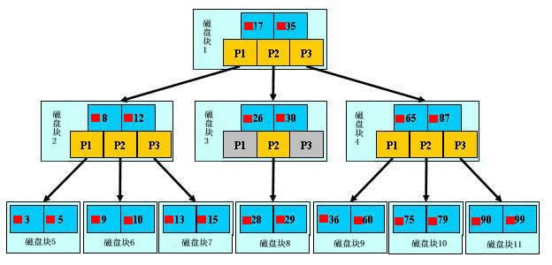
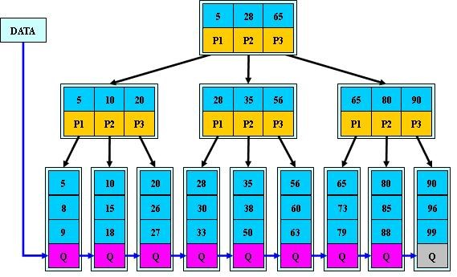
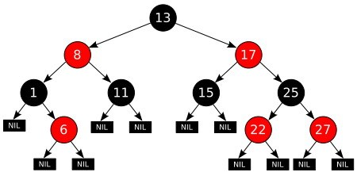
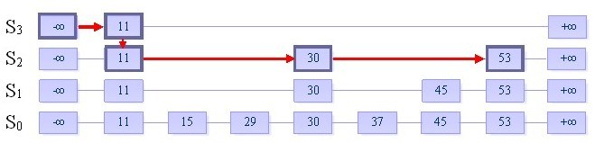

# 常用平衡数据结构

## 平衡二叉树
平衡二叉查找树，又称 AVL树。 它除了具备二叉查找树的基本特征之外，还具有一个非常重要的特点：
- 它的左子树和右子树都是平衡二叉树，且左子树和右子树的深度之差的绝对值（平衡因子）不超过1
- 也就是说AVL树每个节点的平衡因子只可能是-1、0和1（左子树高度减去右子树高度）。

## B树
B树，又叫平衡多路查找树。每个节点都存储key和data，所有节点组成这棵树，并且叶子节点指针为null。一棵m阶的B树 (m叉树)的特性如下：
- 树中每个结点至多有m个孩子
- 除根结点和叶子结点外，其它每个结点至少有[m/2]个孩子
- 若根结点不是叶子结点，则至少有2个孩子
- 所有叶子结点都出现在同一层，叶子结点不包含任何关键字信息(可以看做是外部接点或查询失败的接点，实际上这些结点不存在，指向这些结点的指针都为null)
- 每个非终端结点中包含有n个关键字信息： (n，A0，K1，A1，K2，A2，......，Kn，An)。其中
  - Ki (i=1...n)为关键字，且关键字按顺序排序Ki < K(i-1)
  - Ai为指向子树根的接点，且指针A(i-1)指向子树种所有结点的关键字均小于Ki，但都大于K(i-1)
  - 关键字的个数n必须满足： [m/2]-1 <= n <= m-1

## B+树
B+树，是应文件系统所需而产生的一种B树的变形树。只有叶子节点存储data，叶子节点包含了这棵树的所有键值，叶子节点不存储指针。一棵m阶的B+树和m阶的B-树的差异在于：
- 有n棵子树的结点中含有n个关键字（B树是n棵子树有n+1个关键字）
- 所有的叶子结点中包含了全部关键字的信息，及指向含有这些关键字记录的指针，且叶子结点本身依关键字的大小自小而大的顺序链接。（B树的叶子节点并没有包括全部需要查找的信息）
- 所有的非终端结点可以看成是索引部分，结点中仅含有其子树根结点中最大（或最小）关键字。（B树的非终节点也包含需要查找的有效信息）

B+树的优势所在：
- 由于B+树在内部节点上不包含数据信息，因此在内存页中能够存放更多的key。 数据存放的更加紧密，具有更好的空间局部性。因此访问叶子节点上关联的数据也具有更好的缓存命中率。
- B+树的叶子结点都是相链的，因此对整棵树的便利只需要一次线性遍历叶子结点即可。而且由于数据顺序排列并且相连，所以便于区间查找和搜索。而B树则需要进行每一层的递归遍历。相邻的元素可能在内存中不相邻，所以缓存命中性没有B+树好。

为什么说B+树比B树更适合实际应用中操作系统的文件索引和数据库索引？
- B+树的磁盘读写代价更低
- B+树的查询效率更加稳定
- 实际上B+索引在数据库中有一个特点就是其高扇出性，因此在数据库中，B+树的高度一般不超过3层，也就是对于查找某一键值的行记录，最多只需要2到3次IO。现在一般的机械硬盘的IOPS在100～200之间，2～3次的IO意味着查询时间只需0.02～0.03秒，更有甚者，现在大多数企业都使用SSD固态硬盘，IOPS基本超过50000，查询效率进一步提升。

## 红黑树
R-B Tree，全称是Red-Black Tree，又称为“红黑树”，它一种特殊的二叉查找树。红黑树的每个节点上都有存储位表示节点的颜色，可以是红(Red)或黑(Black)。红黑树的特性:
- 每个节点或者是黑色，或者是红色
- 根节点是黑色
- 每个叶子节点（NIL）是黑色，为空(NIL或NULL)的叶子节点
- 如果一个节点是红色的，则它的子节点必须是黑色的
- 从一个节点到该节点的子孙节点的所有路径上包含相同数目的黑节点
红黑树能够以O(log2(N))的时间复杂度进行搜索、插入、删除操作。此外，任何不平衡都会在3次旋转之内解决。这一点是AVL所不具备的。

红黑树相关定理
- 从根到叶子的最长的可能路径不多于最短的可能路径的两倍长
- 红黑树的树高(h)不大于两倍的红黑树的黑深度(bd)
- 一棵拥有n个内部结点(不包括叶子结点)的红黑树的树高h<=2log(n+1)

实际应用中，很多语言都实现了红黑树的数据结构。比如 TreeMap, TreeSet(Java )、 STL(C++)等。

## 跳跃表（SkipList）
与SkipList对应的是红黑树，他们的功能一样，但在leveldb，hbase的hregion，以及redis的zset，在实现有序数据时，都采样了SkipList，主要的原因是考虑到并发性，红黑数在rebalance时需要lock，这个时间可能很长而且不确定(可能会影响到root node)，在并发环境下造成stop the world。而SkipList的并发性更好，因为在插入节点时，只影响与node相关的几个局部节点。插入、查找和删除操作都仅仅只需要O(log n)对数级别的时间复杂度。
跳表具有如下性质：
- 由很多层结构组成
- 每一层都是一个有序的链表
- 最底层(Level 1)的链表包含所有元素
- 如果一个元素出现在 Level i 的链表中，则它在 Level i 之下的链表也都会出现。
- 每个节点包含两个指针，一个指向同一链表中的下一个元素，一个指向下面一层的元素

跳表构造
1. 给定一个有序的链表
2. 选择连表中最大和最小的元素，然后从其他元素中按照一定算法（随机）随即选出一些元素，将这些元素组成有序链表。这个新的链表称为一层，原链表称为其下一层
3. 为刚选出的每个元素添加一个指针域，这个指针指向下一层中值同自己相等的元素。Top指针指向该层首元素
4. 重复2、3步，直到不再能选择出除最大最小元素以外的元素

跳表插入
1. 使用随机算法，决策插入数据的“高度”，高度h的值由代码 `h=1;while(rand()) h++;`来决定（函数rand()，随机返回1或者0）
2. 从高层至下插入，与普通链表的插入完全相同（先找到插入位置，然后插入）

## 伸展树 (splay tree)
伸展树（Splay Tree），也叫分裂树，是一种二叉排序树，它能在O(log n)内完成插入、查找和删除操作。它由Daniel Sleator和Robert Tarjan创造，后勃刚对其进行了改进。它的优势在于不需要记录用于平衡树的冗余信息。在伸展树上的一般操作都基于伸展操作。
伸展树的出发点是这样的：考虑到局部性原理（刚被访问的内容下次可能仍会被访问，查找次数多的内容可能下一次会被访问），为了使整个查找时间更小，被查频率高的那些节点应当经常处于靠近树根的位置。这样，很容易得想到以下这个方案：每次查找节点之后对树进行重构，把被查找的节点搬移到树根，这种自调整形式的二叉查找树就是伸展树。每次对伸展树进行操作后，它均会通过旋转的方法把被访问节点旋转到树根的位置。

# Treap
同splay tree一样，treap也是一个平衡二叉树，不过Treap会记录一个额外的数据，即优先级。Treap在以关键码构成二叉搜索树的同时，还按优先级来满足堆的性质。因而，Treap=tree+heap。这里需要注意的是，Treap并不是二叉堆，二叉堆必须是完全二叉树，而Treap可以并不一定是。
为了使Treap 中的节点同时满足BST性质和最小堆性质，不可避免地要对其结构进行调整，调整方式被称为旋转。在维护Treap 的过程中，只有两种旋转，分别是左旋转(简称左旋)和右旋转(简称右旋)。
