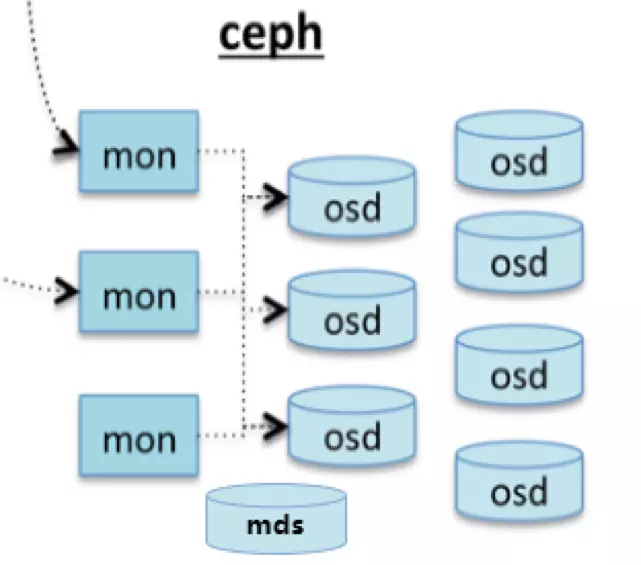
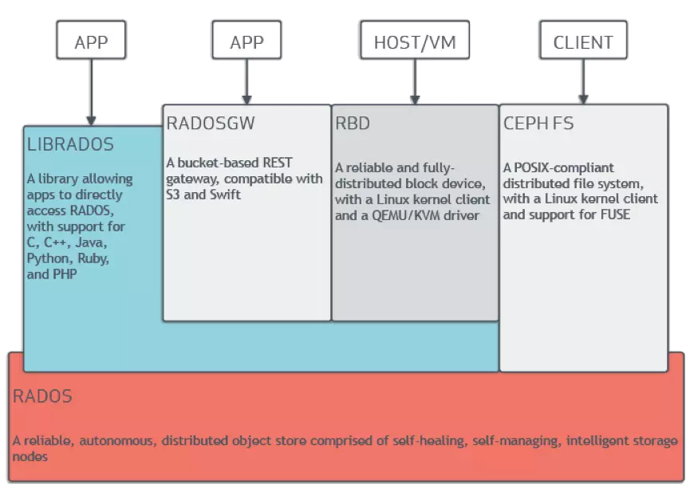
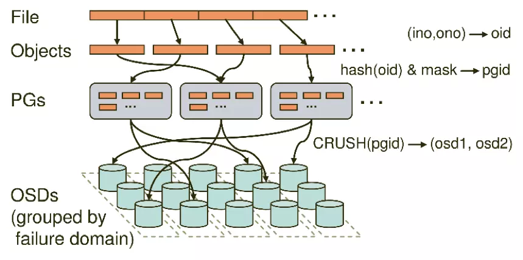
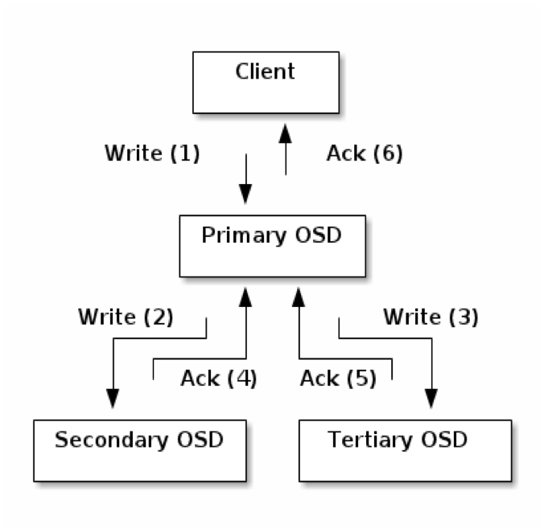
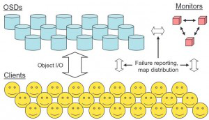

## 交互接口
ceph目前提供三种存储方式接口：
- **对象存储（RGW:RADOS gateway）** Ceph 对象存储服务提供了 REST 风格的 API ，它有与 Amazon S3 和 OpenStack Swift 兼容的接口。也就是通常意义的键值存储，其接口就是简单的GET、PUT、DEL和其他扩展；
- **块存储（RBD：RADOS block device）** RBD通过Linux内核客户端和QEMU/KVM驱动来提供一个分布式的块设备。RBD 是通过librbd库对应用提供块存储，主要面向云平台的虚拟机提供虚拟磁盘；目前 RBD 提供了两个接口，一种是直接在用户态实现， 通过 QEMU Driver 供 KVM 虚拟机使用；另一种是在操作系统内核态实现了一个内核模块，通过该模块可以把块设备映射给物理主机，由物理主机直接访问；
- **文件系统存储 （CEPH FS）** CEPH FS通过Linux内核客户端和FUSE来提供一个兼容POSIX的文档系统。Ceph 文档系统服务提供了兼容 POSIX 的文档系统，可以直接挂载为用户空间文档系统；

块存储和文档存储都是基于对象存储来进行封装实现的，对象存储集群的核心组件是RADOS (Reliable Autonomic Distributed Object Store)。

## 基本概念
服务端 RADOS 集群主要由两种节点组成：
- Monitor 集群提供了整个存储系统的节点信息等全局的配置信息，通过 Paxos 算法保持数据的一致性；
- OSD（Object Storage Device）主要功能是存储数据、复制数据、平衡数据、恢复数据等，与其它OSD间进行心跳检查等，并将一些变化情况上报给 Monitor。一般情况下一块硬盘对应一个OSD，由OSD来对硬盘存储进行管理；

OSD是强一致性的分布式存储，它的读写流程如下：

逻辑上有以下概念：
- Pool 是存储对象的逻辑分区，它规定了数据冗余的类型和对应的副本分布策略；支持两种类型：副本（replicated）和 纠删码（ Erasure Code）；
- PG（ placement group）是一个放置策略组，它是对象的集合，**该集合里的所有对象都具有相同的放置策略**；简单点说就是相同PG内的对象都会放到相同的硬盘上； PG是 ceph 的核心概念， 服务端数据均衡和恢复的最小粒度就是PG；
- 一个Pool里有很多PG，一个PG里包含一堆对象；一个对象只能属于一个PG；PG有主从之分，一个PG分布在不同的OSD上（针对三副本类型），PG和OSD为多对多的关系；
- 对于一个PG，某一个OSD可以作为主OSD，对于另一个PG而言，它是第二或第三个OSD；
- Pool也是一个逻辑存储概念，我们创建Pool的时候，都需要指定PG和PGP的数量，逻辑上来说PG是属于某个Pool的，就有点像Object是属于某个PG的；
- Pool 中指定副本数、复制或纠删码的方式实现高可用，创建的时候指定PG、PGP；

PG和PGP的关系：PG是用来存放object的，PGP相当于是PG存放OSD的一种排列组合，比如有3个osd，osd.1、osd.2和osd.3，副本数是2，如果PGP的数目为1，那么PG存放的OSD组合就只有一种，可能是[osd.1,osd.2]，那么所有的PG主从副本分别存放到osd.1和osd.2，如果PGP设为2，那么其OSD组合可以两种，可能是[osd.1,osd.2]和[osd.1,osd.3]。一般来说应该将PG和PGP的数量设置为相等。
- PG是指定存储池存储对象的目录有多少个，PGP是存储池PG的OSD分布组合个数
- PG的增加会引起PG内的数据进行分裂，分裂相同的OSD上新生成的PG当中
- PGP的增加会引起部分PG的分布进行变化，但是不会引起PG内对象的变动

## 存储过程
Ceph底层是对象系统，所以文档存入时，首先把File切分为RADOS层面的Object，每个Object一般为2MB或4MB(大小可设置)。每个Object通过哈希算法映射到唯一的PG。每个PG通过Crush算法映射到实际存储单元OSD，PG和OSD间是多对多的映射关系。OSD在物理上可划分到多个故障域中，故障域可以跨机柜和服务器，通过策略配置使PG的不同副本位于不同的故障域中。
