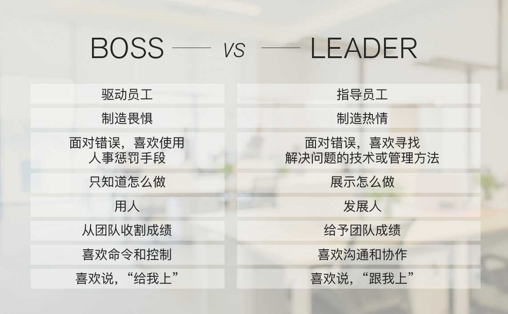

#### 程序员如何用技术变现（上）
- 保持技术和技能的领先，对技术本质和趋势的敏感度
- 注重输出，帮助更多的人，提高影响力

#### 程序员如何用技术变现（下）
- 关注市场需求
- 不缺写代码的人，缺解决难题的人
- 了解技术趋势
  学习技术时，两个问题：1） 这个技术解决什么问题？为什么别的同类技术做不到？2） 为什么是这样解决的？有没有更好的方式？
- 动手能力要强
- 从源头获取信息，英文
- 朋友圈很重要

#### 何为技术领导力
- 我们不难发现，在任何一个团队中，大多数人都是在提问题，而只有少数人在回答这些人的问题，或是在提供解决问题的思路和方案。
- 技术领导力特质：
  - 能够发现问题。能够发现现有方案的问题。
  - 能够提供解决问题的思路和方案，并能比较这些方案的优缺点。
  - 能够做正确的技术决定。用什么样的技术、什么解决方案、怎样实现来完成一个项目。
  - 能够用更优雅，更简单，更容易的方式来解决问题。
  - 能够提高代码或软件的扩展性、重用性和可维护性。
  - 能够用正确的方式管理团队。所谓正确的方式是，一方面是，让正确的人做正确的事，并发挥每个人的潜力；另一方面是，可以提高团队的生产力和人效，找到最有价值的需求，用最少的成本实现之。并且，可以不断地提高自身和团队的标准。
  - 创新能力。能够使用新的方法新的方式解决问题，追逐新的工具和技术。

#### 如何拥有技术领导力
- 扎实的基础技术：编程范式，（epoll里用了红黑树，数据库用了B+索引），《UNIX环境高级编程》《UNIX网络编程》《Windows核心编程》《TCP/IP详解》，数据库原理，分布式架构，包括负载均衡，DNS解析，多子域名，无状态应用，缓存层，数据库分片，容错恢复机制，Paxos，Map/Reduce等。
- 非同一般的学习能力：学习新技术，学习关键技术，多用英文资料。与高手交流。不怕困难。开放的心态。
- 坚持做正确的事：提升做事效率，前沿的事，知识密集型的事，技术驱动的事。
- 不断得高对自己的要求标准：Google的自我评分卡，敏锐的技术嗅觉，强调实践，学以致用，永远写代码。《技术领导之路》、《卓有成效的管理者》

#### 推荐阅读：每个程序员都该知道的事
- [程序员必读书目](https://stackoverflow.com/questions/1711/what-is-the-single-most-influential-book-every-programmer-should-read)
- [计算机专业必知](http://matt.might.net/articles/what-cs-majors-should-know/)
- [如何做codereview](https://thenewstack.io/linkedin-code-review/)
- [语言分析](https://cacm.acm.org/magazines/2017/10/221326-a-large-scale-study-of-programming-languages-and-code-quality-in-github/)
- 电子书：[Optimizing Software in C++](http://agner.org/optimize/optimizing_cpp.pdf)

#### 答疑解惑：渴望、热情和选择
- 对学习有热情么？保持热情
- 隔三差五去面试一次，看看自己的水平
- 客观审视自己，自己想要什么，注重长期的可能性，多关注得到的东西，不要和大众的思维一样

#### 如何成为一个大家愿意追随的 Leader？

如何成为leader？帮人解决问题，被人所依赖，赢得他人的信任，**开放的心态，甘当铺路石，一起进步**

#### 时间管理：同扭曲时间的事儿抗争
- 主动管理，别被动地被别人安排时间，反转控制
- 学会说不
  - 给出一个自己可以做到的方案来拒绝做不到的方案
  - 多问为什么，为什么要这样做，目的是什么，如果balaba，会怎么样
  - 想办法把压力还回去
- 老板看到加班就高兴？
- 会上应该讨论方案而不是问题

#### 时间管理：投资赚取时间
- 系统地学习基础知识
- 花时间解放自己的生产力
- 花时间放在让自己成长的事上
- 花时间建立高效的环境上
- 时间规划
  - 短作业优先
  - 想清楚再做
  - 关注场景利益规划
- 用好自己的时间
  - 将军赶路不追小兔，保持专注
  - 形成习惯！
  - **形成正反馈，要反思复盘**

#### 答疑解惑：我们应该能够识别的表象和本质
- 持续保持兴趣
- 要用技术解决什么样的问题，场景非常重要
- 如何降低学习成本，提高易用性，让技术更普及
- *世界简单粗暴地运行着*

#### Google 评分卡
- 0 - you are unfamiliar with the subject area.
- 1 - you can read / understand the most fundamental aspects of the subject area.
- 2 - ability to implement small changes, understand basic principles and able to figure out additional details with minimal help.
- 3 - basic proficiency in a subject area without relying on help.
- 4 - you are comfortable with the subject area and all routine work on it: For software areas - ability to develop medium programs using all basic language features w/o book, awareness of more esoteric features (with book).For systems areas - understanding of many fundamentals of networking and systems administration, ability to run a small network of systems including recovery, debugging and nontrivial troubleshooting that relies on the knowledge of internals.
- 5 - an even lower degree of reliance on reference materials. Deeper skills in a field or specific technology in the subject area.
- 6 - ability to develop large programs and systems from scratch. Understanding of low level details and internals. Ability to design / deploy most large, distributed systems from scratch.
- 7 - you understand and make use of most lesser known language features, technologies, and associated internals. Ability to automate significant amounts of systems administration.
- 8 - deep understanding of corner cases, esoteric features, protocols and systems including “theory of operation”. Demonstrated ability to design, deploy and own very critical or large infrastructure, build accompanying automation.
- 9 - could have written the book about the subject area but didn’t; works with standards committees on defining new standards and methodologies.
- 10 - wrote the book on the subject area (there actually has to be a book). Recognized industry expert in the field, might have invented it.

Subject Areas:
- TCP/IP Networking (OSI stack, DNS etc)
- Unix/Linux internals
- Unix/Linux Systems administration
- Algorithms and Data Structures
- C
- C++
- Python
- Java
- Perl
- Go
- Shell Scripting (sh, Bash, ksh, csh)
- SQL and/or Database Admin
- Scripting language of your choice (not already mentioned) _
- People Management
- Project Management
