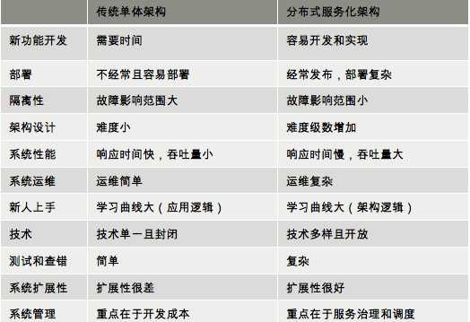

#### 分布式系统架构的冰与火

文章 Martin Fowler：《Mircroservices》

#### 从亚马逊的实践，谈分布式系统的难点
- 亚马逊的实践
  - 分布式服务的架构需要分布式的团队架构
  - 分布式服务查错不容易
  - 没有专职的测试人员，也没有专职的运维人员，Eat Your Own Dog Food
  - 运维优先，崇尚简化和自动化
  - 内部服务和外部服务一致
- 分布式系统问题
  - 异构系统的不标准：软件、通讯协议、数据格式、开发运维过程
  - 系统架构中的服务依赖性问题：
  - 故障发生的概率更大
  - 多层架构的运维复杂度更高
- 其他
  - HTTP Swagger规范
  - SLA要求我们定义出关键指标
  - 系统通常分为4层：1）基础层：机器、网络、存储设备，2）平台层：Tomcat、MySQL、Redis、Kafka等，3）应用层：业务软件，4）接入层：接入用户请求的网关、负载均衡或CDN、DNS等
  - 防御编程

#### 分布式系统的技术栈
- 目的
  - 提升系统的吞吐量：1）缓存（各个层都需要），2）负载均衡（水平扩展），3）异步调用（消息队列），4）数据分区和数据镜像（读写分离，数据一致性问题）
  - 提升系统的稳定性：1）服务拆分（故障隔离，服务模块重用），2）服务冗余（去除单点，弹性伸缩），3）限流降级，4）高可用架构（多租户隔离，灾备多活），5）高可用运维（CI/CD）
- 关键技术
  - 服务治理。服务拆分、服务发现、服务调用、服务依赖
  - 架构软件管理。服务的版本管理，整个架构的生命周期管理，服务编排、聚合、事务处理，服务调度
  - DevOps
  - 自动化运维
  - 资源调度管理：云平台IaaS层
  - 整体架构监控（应用层、中间件层、基础层）
  - 流量控制：负载均衡、路由、熔断、降级、限流
- 分布式系统的“纲”

#### 分布式系统关键技术：全栈监控
- 全栈监控：各种指标
- 关联分析
- 跨系统调用的串联：Zipkin
- 实时报警和自动处理
- 系统性能分析

#### 分布式系统关键技术：服务调度
- 服务关键程度
- 服务依赖关系：不要有依赖环
- 服务发现
- 架构的版本管理
- 服务应用生命周期全管理

故障迁移
- 宠物模式：StatefulSet，一定要救活
- 奶牛模式：Deployment，重新启动一哥

#### 分布式系统关键技术：流量与数据调度
- 服务流控。服务发现、路由、降级、熔断、保护
- 流量控制。负载均衡、流量分配、流量控制、异地灾备
- 流量管理。协议转换、请求校验、数据缓存、数据计算

API Gateway
分布式师父一致性的问题：数据高可用 -> 写多分数据 -> 数据一致性问题 -> 性能问题
Master-Slave方案；Master-Master方案，两阶段提交，三阶段提交，Paxos方案。
应用层：两阶段提交
数据层：Paxos、Raft、NWR等
状态数据调度：分布式存储系统来解决

#### 洞悉 PaaS 平台的本质
- 软件能力
  - 提升服务的SLA（**99.999% 年down机时间5.26分钟**）：1）高可用系统，2）自动化运维
  - 能力和资源的重用或复用：1）软件抽象能力，2）软件标准化能力（通讯协议、开发运维流程），3）过程的自动化
  - 总结：分布式多层系统架构，服务化的能力供应，自动化运维能力

#### 推荐阅读：分布式系统架构经典资料
- 基础理论
  - CAP 定理《CAP Confusion： Problems with partition tolerance》《Google：Transaction Across DatatCenter》
  - Fallacies of Distributed Computing：分布式程序员常有的错误假设
- 经典资料
  - Distributed systems theory for the distributed systems engineer：整理了分布式必须掌握的只是列表，构建分布式系统的难点
  - FLP Impossibility Result
  - An introduction to distributed systems：基础课程提纲，几乎涵盖了所有的知识点
  - Distributed Systems for fun and profit：一般小书，分布式中的关键问题，时间和复制策略
  - Distributed Systems: Principles and Paradigms：经典教材
  - Scalable Web Architecture and Distributed Systems：免费的小册子，中文《可扩展的Web架构和分布式系统》
  - Principles of Distributed Systems：苏黎世联邦理工学院教材
  - Making reliable distributed systems in the presence of software errors：Erlang之父力作
  - Designing Data Intensive Applications：非常好的书，深入到基本数据结构，今年看过的最好的书

#### 推荐阅读：分布式数据调度相关论文
Google File System、MapReduce、BigTable
- Paxos算法
  - Neat Algorithms - Paxos
  - Paxos by Examples
- Raft算法
- 逻辑钟和向量钟
- Gossip协议
- 分布式数据库
