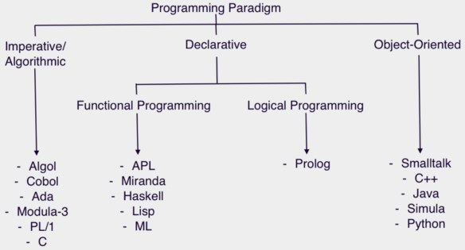

#### 编程范式游记（1）：起源
- Programming Paradigm
- 抽象类型：泛型编程（Generic Programming算法的泛型、类型的泛型、数据结构（数据容器）的泛型）
- c语言1972年诞生

#### 编程范式游记（2）：泛型编程
- c++语言1980年发明，《c++语言的设计和演化》
- 耗子的《c++的坑真多么？》

#### 编程范式游记（3）：类型系统和泛型的本质
- 屏蔽掉数据的操作细节，抽象，让算法更通用

#### 编程范式游记（4）：函数式编程
- 更为抽象的泛型
- 函数编程：stateless、immutable（入参不能动）
- 优势：无状态，并行执行，随便拷贝代码，函数执行没顺序问题

#### 编程范式游记（5）：修饰器模式
- 装饰函数

#### 编程范式游记（6）：面向对象编程
设计模式：可复用面向对象软件的基础
- Program to an 'interface', not an 'implementation'."
  - 使用者不需要知道数据类型、结构、算法的细节。
  - 使用者不需要知道实现细节，只需要知道提供的接口。
  - 利于抽象、封装、动态绑定、多态。
  - 符合面向对象的特质和理念。
- Favor 'object composition' over 'class inheritance'
  - 继承需要给子类暴露一些父类的设计和实现细节。
  - 父类实现的改变会造成子类也需要改变。
  - 我们以为继承主要是为了代码重用，但实际上在子类中需要重新实现很多父类的方法。 
  - 继承更多的应该是为了多态。
- IoC/DIP（控制反转 / 依赖倒置(面向对象编程的核心原则)）
- S.O.L.I.D（单一功能、开闭原则、里氏替换、接口隔离以及依赖反转，是面向对象设计的五个基本原则）

#### 编程范式游记（7）：基于原型的编程范式
- 基于原型（prototype）的编程其实也是面向对象编程的一种方式。没有 class 化的，直接使用对象。又叫，基于实例的编程。其主流的语言就是 JavaScript。

#### 编程范式游记（8）：Go 语言的委托模式
- 这是不是和最一开始的 C++ 的泛型编程很像？也和 map、reduce、filter 这样的只关心控制流程，不关心业务逻辑的做法很像？而且，一开始用一个 `UndoableIntSet` 来包装 `IntSet` 类，到反过来在 `IntSet` 里依赖`Undo`类，这就是控制反转 IoC。

```go
type UndoableIntSet struct {
    IntSet // Embedding(delegation)
    functions []func()
}

type IntSet struct {
    data map[int]bool
    undo Undo
}
```

#### 编程范式游记（9）：编程的本质
- 任何算法都会有两个部分， 一个是 Logic 部分，这是用来解决实际问题的。另一个是 Control 部分，这是用来决定用什么策略来解决问题。Logic 部分是真正意义上的解决问题的算法，而 Control 部分只是影响解决这个问题的效率。程序运行的效率问题和程序的逻辑其实是没有关系的。我们认为，如果将 Logic 和 Control 部分有效地分开，那么代码就会变得更容易改进和维护。
- 就像我们面向对象中依赖于接口而不是实现一样，接口是对逻辑的抽象，真正的逻辑放在不同的具现类中，通过多态或是依赖注入这样的控制来完成对数据在不同情况下的不同处理。
- Control 是可以标准化的。比如：遍历数据、查找数据、多线程、并发、异步等，都是可以标准化的。因为 Control 需要处理数据，所以标准化 Control，需要标准化 Data Structure，我们可以通过泛型编程来解决这个事。而 Control 还要处理用户的业务逻辑，即 Logic。所以，我们可以通过标准化接口 / 协议来实现，我们的 Control 模式可以适配于任何的 Logic。
- [Regular Expression Matching Can Be Simple And Fast](https://swtch.com/~rsc/regexp/regexp1.html)

如何分离 control 和 logic 呢？我们可以使用下面的这些技术来解耦。 
- State Machine
  - 状态定义
  - 状态变迁条件
  - 状态的 action
- DSL – Domain Specific Language
  - HTML，SQL，Unix Shell Script，AWK，正则表达式……
- 编程范式
  - 面向对象：委托、策略、桥接、修饰、IoC/DIP、MVC……
  - 函数式编程：修饰、管道、拼装
  - 逻辑推导式编程：Prolog

这就是编程的本质：Logic 部分才是真正有意义的（What） Control 部分只是影响 Logic 部分的效率（How）

#### 编程范式游记（10）：逻辑编程范式
- prolog

#### 编程范式游记（11）：程序世界里的编程范式


