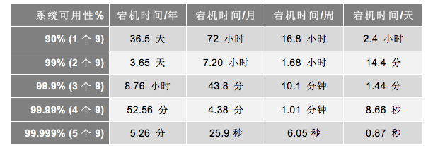
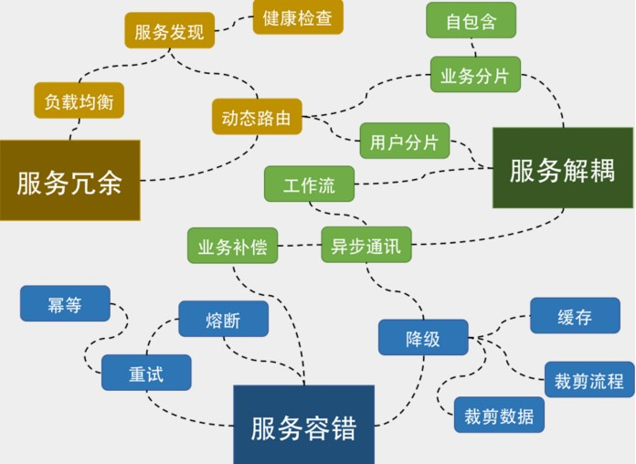
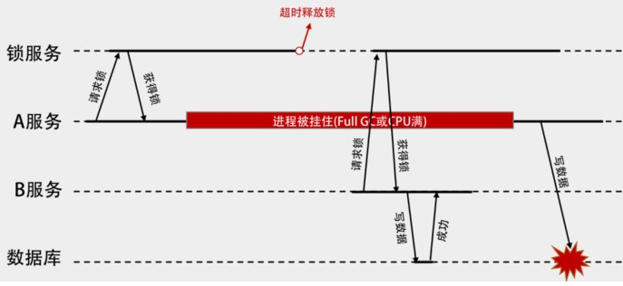
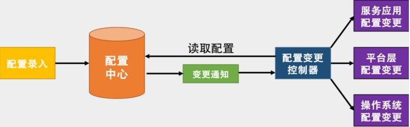
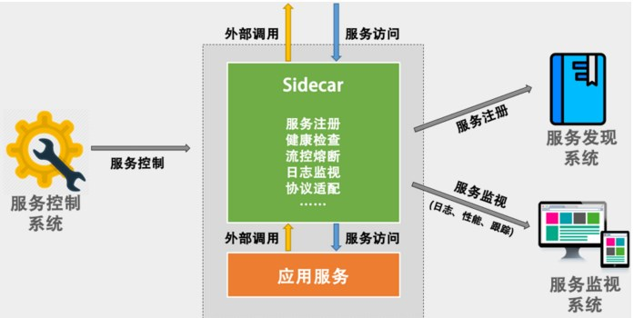
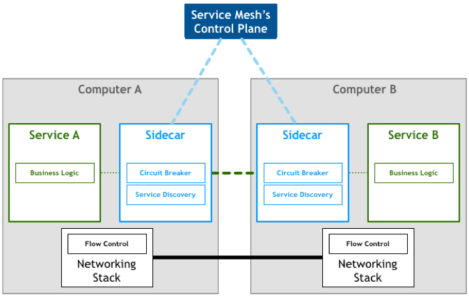
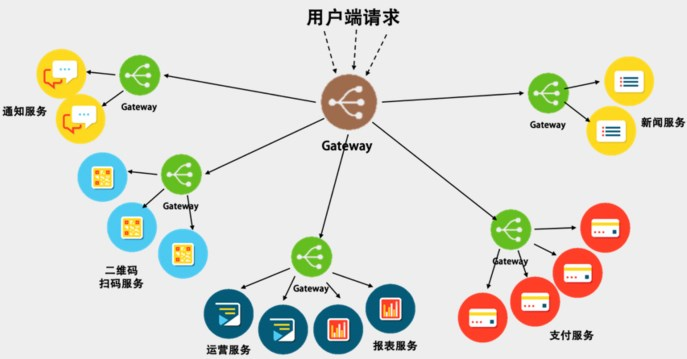
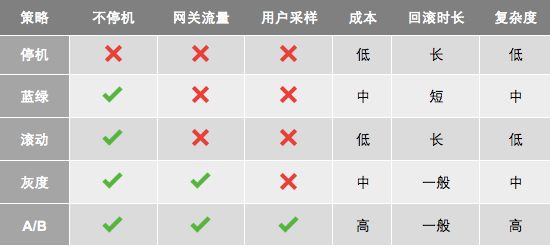
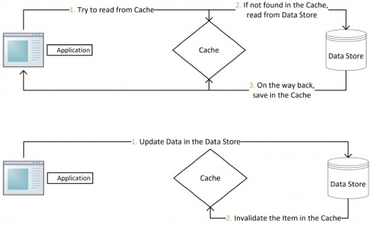

## 弹力设计篇

#### 认识故障和弹力设计
- 容错设计又叫弹力设计，其中着眼于分布式系统的各种“容忍”能力，包括容错能力（服务隔离、异步调用、请求幂等性）、可伸缩性（有 / 无状态的服务）、一致性（补偿事务、重试）、应对大流量的能力（熔断、降级）。可以看到，在确保系统正确性的前提下，系统的可用性是弹力设计保障的重点。
- Resiliency（弹力）

#### 隔离设计 Bulkheads
要能做好隔离设计，我们需要有如下的一些设计考量。
- 我们需要定义好隔离业务的大小和粒度，过大和过小都不好。这需要认真地做业务上的需求和系统分析。
- 无论是做系统版块还是多租户的隔离，你都需要考虑系统的复杂度、成本、性能、资源使用的问题，找到一个合适的均衡方案，或是分布实施的方案尤其重要，这其中需要你定义好要什么和不要什么。因为，我们不可能做出一个什么都能满足的系统。
- 隔离模式需要配置一些高可用、重试、异步、消息中间件，流控、熔断等设计模式的方式配套使用。
- 不要忘记了分布式系统中的运维的复杂度的提升，要能驾驭得好的话，还需要很多自动化运维的工具，尤其是使用像容器或是虚拟机这样的虚拟化技术可以帮助我们更方便地管理，和对比资源更好地利用。否则做出来了也管理不好。
- 最后，你需要一个非常完整的能够看得到所有服务的监控系统，这点非常重要。

#### 异步通讯设计 Asynchronous
同步调用有四点问题：影响吞吐量、消耗系统资源、只能一对一，以及有多米诺骨牌效应。
异步通讯的三种方式
- 请求响应式：发送方（sender）会直接请求接收方（receiver），被请求方接收到请求后，直接返回——收到请求，正在处理。
- 订阅的方式：接收方（receiver）会来订阅发送方（sender）的消息，发送方会把相关的消息或数据放到接收方所订阅的队列中，而接收方会从队列中获取数据。
- 通过 Broker 的方式：所谓 Broker，就是一个中间人，发送方（sender）和接收方（receiver）都互相看不到对方，它们看得到的是一个 Broker，发送方向 Broker 发送消息，接收方向 Broker 订阅消息。如下图所示。
- 事件驱动设计：上述的第二种和第三种方式就是比较著名的事件驱动架构（EDA – Event Driven Architecture）。
  - 优点：解耦服务，服务故障隔离，服务不会互相block，服务吞吐量解耦，容易增加Adapter（如日志、认证、版本、限流、降级、熔断等）
  - 缺点：业务流程不再明显易管理，事件可能乱序，事务处理复杂，需要使用两阶段提交来做强一致性，或是退缩到最终一致性

异步通讯的设计重点
- 异步通讯最重要的是解耦服务间的依赖。最佳解耦的方式是通过 Broker 的机制。
  - 解耦的目的是让各个服务的隔离性更好，这样不会出现“一倒倒一片”的故障。
  - 异步通讯的架构可以获得更大的吞吐量，而且各个服务间的性能不受干扰相对独立。
  - 利用 Broker 或队列的方式还可以达到把抖动的吞吐量变成均匀的吞吐量，这就是所谓的“削峰”，这对后端系统是个不错的保护。
  - 服务相对独立，在部署、扩容和运维上都可以做到独立不受其他服务的干扰。
- 但我们需要知道这样的方式带来的问题，所以在设计成异步通信的时候需要注意如下事宜。
  - 用于异步通讯的中间件 Broker 成为了关键，需要设计成高可用不丢消息的。另外，因为是分布式的，所以可能很难保证消息的顺序，因此你的设计最好不依赖于消息的顺序。
  - 异步通讯会导致业务处理流程不那么直观，因为像接力一样，所以在 Broker 上需要有相关的服务消息跟踪机制，否则出现问题后不容易调试。
  - 因为服务间只通过消息交互，所以业务状态最好由一个总控方来管理，这个总控方维护一个业务流程的状态变迁逻辑，以便系统发生故障后知道业务处理到了哪一步，从而可以在故障清除后继续处理。
  - 消息传递中，可能有的业务逻辑会有像 TCP 协议那样的 send 和 ACK 机制。比如：A 服务发出一个消息之后，开始等待处理方的 ACK，如果等不到的话，就需要做重传。此时，需要处理方有幂等的处理，即同一件消息无论收到多少次都只处理一次。

#### 幂等性设计 Idempotency
解决超时带来的问题
- 一种是需要下游系统提供相应的查询接口。上游系统在 timeout 后去查询一下。如果查到了，就表明已经做了，成功了就不用做了，失败了就走失败流程。
- 另一种是通过幂等性的方式。也就是说，把这个查询操作交给下游系统，我上游系统只管重试，下游系统保证一次和多次的请求结果是一样的。
  - 需要全局ID：在全局唯一 ID 的算法中，这里介绍一个 Twitter 的开源项目 Snowflake

#### 服务的状态 State
- 关于可扩展的有状态服务，这里强烈推荐 Twitter 的美女工程师 Caitie McCaffrey 的演讲 Youtube 视频《Building Scalable Stateful Service》(演讲 PPT)，其文字版是在 High Scalability 上的这篇文章《Making the Case for Building Scalable Stateful Services in the Modern Era》
- 有状态的服务，它们通过 Sticky Session、一致性 Hash 和 DHT 等技术实现状态和请求的关联，并将数据同步到分布式数据库中；利用分布式文件系统，还能在节点挂掉时快速启动新实例。

#### 补偿事务 Compensating Transaction
出现了 ACID 的一个变种 BASE。
- Basic Availability：基本可用。这意味着，系统可以出现暂时不可用的状态，而后面会快速恢复。
- Soft-state：软状态。它是我们前面的“有状态”和“无状态”的服务的一种中间状态。也就是说，为了提高性能，我们可以让服务暂时保存一些状态或数据，这些状态和数据不是强一致性的。
- Eventual Consistency：最终一致性，系统在一个短暂的时间段内是不一致的，但最终整个系统看到的数据是一致的。

有趣的是，ACID 的意思是酸，而 BASE 却是碱的意思，因此这是一个对立的东西。其实，从本质上来讲，酸（ACID）强调的是一致性（CAP 中的 C），而碱（BASE）强调的是可用性（CAP 中的 A）。

#### 重试设计 Retry
- 重试的场景：调用超时、被调用端返回了某种可以重试的错误（如繁忙中、流控中、维护中、资源不足等）；而对于一些别的错误，则最好不要重试，比如：业务级的错误（如没有权限、或是非法数据等错误），技术上的错误（如：HTTP 的 503 等，这种原因可能是触发了代码的 bug，重试下去没有意义）。
- 重试的策略：Exponential Backoff 的策略，也就是所谓的 " 指数级退避 "。

#### 熔断设计 Circuit Breaker
- 熔断器模式可以防止应用程序不断地尝试执行可能会失败的操作，使得应用程序继续执行而不用等待修正错误，或者浪费 CPU 时间去等待长时间的超时产生。熔断器模式也可以使应用程序能够诊断错误是否已经修正。如果已经修正，应用程序会再次尝试调用操作。
- 实现熔断器模式使得系统更加稳定和有弹性，在系统从错误中恢复的时候提供稳定性，并且减少了错误对系统性能的影响。它通过快速地拒绝那些试图有可能会导致错误的服务调用，而不会去等待操作超时或者永远不返回结果来提高系统的响应时间。

#### 限流设计 Throttle
- 限流的策略：拒绝服务、服务降级、特权请求、延时处理、弹性伸缩
- 限流方式：计数器方式、队列算法、漏斗算法Leaky Bucket、令牌桶算法 Token Bucket、基于响应时间的动态限流

[TCP 的那些事（下）](https://coolshell.cn/articles/11609.html) 、[Reservoir sampling](https://en.wikipedia.org/wiki/Reservoir_sampling)
限流主要是有四个目的。 
- 为了向用户承诺 SLA。我们保证我们的系统在某个速度下的响应时间以及可用性。
- 同时，也可以用来阻止在多租户的情况下，某一用户把资源耗尽而让所有的用户都无法访问的问题。
- 为了应对突发的流量。
- 节约成本。我们不会为了一个不常见的尖峰来把我们的系统扩容到最大的尺寸。而是在有限的资源下能够承受比较高的流量。

在设计上，我们还要有以下的考量。
- 限流应该是在架构的早期考虑。当架构形成后，限流不是很容易加入。
- 限流模块必需是非常好的性能，而且对流量的变化也是非常灵敏的，否则太过迟钝的限流，系统早因为过载而挂掉了。
- 限流应该有个手动的开关，这样在应急的时候，可以手动操作。
- 当限流发生时，应该有个监控事件通知。让我们知道有限流事件发生，这样，运维人员可以及时跟进。而且还可以自动化触发扩容或降级，以缓解系统压力。
- 当限流发生时，对于拒掉的请求，我们应该返回一个特定的限流错误码。这样，可以和其它错误区分开来。而客户端看到限流，可以调整发送速度，或是走重试机制。
- 限流应该让后端的服务感知到。限流发生时，我们应该在协议头中塞进一个标识，比如 HTTP Header 中，放入一个限流的级别，告诉后端服务目前正在限流中。这样，后端服务可以根据这个标识决定是否做降级。

#### 降级设计 degradation
一般来说，我们的降级需要牺牲掉的东西有： 
- 降低一致性。从强一致性变成最终一致性。
- 停止次要功能。停止访问不重要的功能，从而释放出更多的资源。
- 简化功能。把一些功能简化掉，比如，简化业务流程，或是不再返回全量数据，只返回部分数据。

我们一般使用 Cache Aside 模式或是 Read Through 模式。也就是下图所示的这个策略。 
- 失效：应用程序先从 cache 取数据，没有得到，则从数据库中取数据，成功后，放到缓存中。
- 命中：应用程序从 cache 中取数据，取到后返回。
- 更新：先把数据存到数据库中，成功后，再让缓存失效。

#### 弹力设计总结

## 管理设计篇

#### 分布式锁 Distributed Lock

A得到锁，超时释放，B得到锁，写入数据，GC后，A仍要写入数据，出错
增加版本号（乐观锁），**fence token**，timestamp
分布式锁设计的重点
- 需要给一个锁被释放的方式，以避免请求者不把锁还回来，导致死锁的问题。Redis 使用超时时间，ZooKeeper 可以依靠自身的 sessionTimeout 来删除节点。
- 分布式锁服务应该是高可用的，而且是需要持久化的。对此，你可以看一下 [Redis 的文档 RedLock](https://redis.io/topics/distlock) 看看它是怎么做到高可用的。
- 要提供非阻塞方式的锁服务。 还要考虑锁的可重入性。

ZooKeeper 在使用起来需要有一些变通的方式，好在 Apache 有 [Curator](https://curator.apache.org/) 帮我们封装了各种分布式锁的玩法

#### 配置中心 Configuration Management
配置中心的设计
区分软件的配置：有一种方式是把软件的配置分成静态配置和动态配置。所谓静态配置其实就是在软件启动时的一些配置，运行时基本不会进行修改，也可以理解为是环境或软件初始化时需要用到的配置。例如，操作系统的网络配置，软件运行时 Docker 进程的配置，这些配置在软件环境初始化时就确定了，未来基本不会修改了。而所谓动态配置其实就是软件运行时的一些配置，在运行时会被修改。比如，日志级别、降级开关、活动开关。
- 按运行环境分。一般来说，会有开发环境、测试环境、预发环境、生产环境。这些环境上的运行配置都不完全一样，但是理论来说，应该是大同小异的。
- 按依赖区分。一种是依赖配置，一种是不依赖的内部配置。比如，外部依赖的 MySQL 或 Redis 的连接配置。还有一种完全是自己内部的配置。
- 按层次分。就像云计算一样，配置也可以分成 IaaS、PaaS、SaaS 三层。基础层的配置是操作系统的配置，中间平台层的配置是中间件的配置，如 Tomcat 的配置，上层软件层的配置是应用自己的配置。

我们把软件的配置分成三层。
- 操作系统层和平台层的配置项得由专门的运维人员或架构师来配置。其中的 value 应该是选项，而不是让用户可以自由输入的，最好是有相关的模板来初始化全套的配置参数。
- 而应用层的配置项，需要有相应的命名规范，最好有像 C++ 那样的名字空间的管理，确保不同应用的配置项不会冲突。
- 如果有外部服务依赖的配置，强烈建议不要放在配置中心里，而要放在服务发现系统中。因为一方面这在语义上更清楚一些，另外，这样会减少因为运行不同环境而导致配置不同的差异性（如测试环境和生产环境的不同）。

#### 边车模式 Sidecar
- 以软件包的方式可以和应用密切集成，有利于资源的利用和应用的性能，但是对应用有侵入，而且受应用的编程语言和技术限制。同时，当软件包升级的时候，需要重新编译并重新发布应用。
- 以 Sidecar 的方式，对应用服务没有侵入性，并且不用受到应用服务的语言和技术的限制，而且可以做到控制和逻辑的分开升级和部署。但是，这样一来，增加了每个应用服务的依赖性，也增加了应用的延迟，并且也会大大增加管理、托管、部署的复杂度。

边车设计的重点
- 控制和逻辑的分离。
- 服务调用中上下文的问题。

熔断、路由、服务发现、计量、流控、监视、重试、幂等、鉴权等控制面上的功能，以及其相关的配置更新，本质来上来说，和服务的关系并不大。
边车作为另一个进程，和服务进程部署在同一个结点中，通过一个标准的网络协议，如 HTTP 来进行通信。这样可以做到低延迟和标准化。

#### 服务网格 Service Mesh
Service Mesh 这个服务网络专注于处理服务和服务间的通讯。其主要负责构造一个稳定可靠的服务通讯的基础设施，并让整个架构更为的先进和 Cloud Native。在工程中，Service Mesh 基本来说是一组轻量级的服务代理和应用逻辑的服务在一起，并且对于应用服务是透明的。
[The 8 Fallacies of Distributed Computing](https://en.wikipedia.org/wiki/Fallacies_of_distributed_computing)

目前比较流行的 Service Mesh 开源软件是 Istio 和 Linkerd，我还是推荐大家使用 Rust/Go 语言实现的 lstio 和 Conduit，后者比前者要轻很多。你可以根据你的具体需求挑选，或是自己实现。lstio 是目前最主流的解决方案，其架构并不复杂，其核心的 Sidecar 被叫做 Envoy（使者），用来协调服务网格中所有服务的出入站流量，并提供服务发现、负载均衡、限流熔断等能力，还可以收集大量与流量相关的性能指标。

#### 网关模式 Gateway

Gateway 是一个服务器，也可以说是进入系统的唯一节点。这跟面向对象设计模式中的 Facade 模式很像。Gateway 封装内部系统的架构，并且提供 API 给各个客户端。它还可能有其他功能，如授权、监控、负载均衡、缓存、熔断、降级、限流、请求分片和管理、静态响应处理，等等。
- 网关需要有以下的功能：请求路由，服务注册，负载均衡，弹力设计，安全方面
- 也可以做灰度发布，API 聚合（使用网关可将多个单独请求聚合成一个请求），API 编排（ DSL 来定义和编排不同的 API）

网关的设计重点
- 高性能：对于高性能，最好使用高性能的编程语言来实现，如 C、C++、Go 和 Java。网关对后端的请求，以及对前端的请求的服务一定要使用异步非阻塞的 I/O 来确保后端延迟不会导致应用程序中出现性能问题。C 和 C++ 可以参看 Linux 下的 epoll 和 Windows 的 I/O Completion Port 的异步 IO 模型，Java 下如 Netty、Vert.x、Spring Reactor 的 NIO 框架。当然，我还是更喜欢 Go 语言的 goroutine 加 channel 玩法。
- 高可用：
  - 集群化：网关要成为一个集群，其最好可以自己组成一个集群，并可以自己同步集群数据
  - 服务化：网关还需要做到在不间断的情况下修改配置，一种是像 Nginx reload 配置那样，可以做到不停服务，另一种是最好做到服务化。也就是说，得要有自己的 Admin API 来在运行时修改自己的配置
  - 持续化：比如重启，就是像 Nginx 那样优雅地重启
- 高扩展：一个好的 Gateway 还需要是可以扩展的，并能进行二次开发的。当然，像 Nginx 那样通过 Module 进行二次开发的固然可以。但我还是觉得应该做成像 AWS Lambda 那样的方式，也就是所谓的 Serverless 或 FaaS（Function as a Service）那样的方式
- 运维方面
  - 业务松耦合，协议紧耦合。除了服务发现外，网关不应该有第三方服务的依赖
  - 应用监视，提供分析数据。实施分布式链路跟踪
  - 用弹力设计保护后端服务。网关上一定要实现熔断、限流、重试和超时等弹力设计。
  - DevOps：
- 架构方面
  - 不要在网关中的代码里内置聚合后端服务的功能
  - 网关应该靠近后端服务，并和后端服务使用同一个内网，这样可以保证网关和后端服务调用的低延迟
  - 网关也需要做容量扩展，所以需要成为一个集群来分担前端带来的流量
  - 对于服务发现，可以做一个时间不长的缓存
  - 为网关考虑 bulkhead 设计方式
- 安全方面
  - 加密数据
  - 校验用户的请求
  - 检测异常访问

#### 部署升级策略
蓝绿部署是为了不停机，灰度部署是对新版本的质量没信心。而 AB 测试是对新版的功能没信心。注意，一个是质量，一个是功能。AB 测试，其包含了灰度发布的功能

- 停机部署（Big Bang/Recreate）： 把现有版本的服务停机，然后部署新的版本。
- 蓝绿部署（Blue/Green/Stage）：部署好新版本后，把流量从老服务那边切过来。
- 滚动部署（Rolling Update/Ramped）： 一点一点地升级现有的服务。
- 灰度部署（金丝雀，Canary）：把一部分用户切到新版上来，然后看一下有没有问题。如果没有问题就继续扩大升级，直到全部升级完成。
- AB 测试（A/B Testing）：同时上线两个版本，然后做相关的比较。

## 性能设计篇

##### 缓存 Cache
Cache Aside 更新模式
- 失效：应用程序先从 cache 取数据，没有得到，则从数据库中取数据，成功后，放到缓存中。
- 命中：应用程序从 cache 中取数据，取到后返回。
- 更新：先把数据存到数据库中，成功后，再让缓存失效。

[Why does Facebook use delete to remove the key-value pair in Memcached instead of updating the Memcached during write request to the backend?](https://www.quora.com/Why-does-Facebook-use-delete-to-remove-the-key-value-pair-in-Memcached-instead-of-updating-the-Memcached-during-write-request-to-the-backend)

Read/Write Through 更新模式：应用认为后端就是一个单一的存储，而存储自己维护自己的 Cache。
Read Through：当缓存失效的时候（过期或 LRU 换出），Cache Aside 是由调用方负责把数据加载入缓存，而 Read Through 则用缓存服务自己来加载，从而对应用方是透明的。
Write Through：当有数据更新的时候，如果没有命中缓存，直接更新数据库，然后返回。如果命中了缓存，则更新缓存，然后由 Cache 自己更新数据库（这是一个同步操作）。
Write Behind Caching: 更新模式 Write Behind 又叫 Write Back，在更新数据的时候，只更新缓存，不更新数据库，而我们的缓存会异步地批量更新数据库

缓存设计的重点
- 内存和 IO 密集型的应用
- 缓存的好坏要看命中率，一般来说命中率到 80% 以上就算很高了
- 缓存是通过牺牲强一致性来提高性能的

#### 异步处理 Asysnchronous
- Event Sourcing（事件溯源）设计模式
异步处理的设计要点
- 异步处理中的事件驱动和事件溯源是两个比较关键的技术
- 异步处理系统的本质是把被动的任务处理变成主动的任务处理，其本质是在对任务进行调度和统筹管理

#### 数据库扩展
- 读写分离 CQRS：Command and Query Responsibility Segregation
- 分库分表 Sharding
  - 数据库分片必须考虑业务，从业务的角度入手，而不是从技术的角度入手
  - 请只考虑业务分片。请不要走哈希散列的分片方式。

#### 秒杀 Flash Sales
在 CDN 上，这 100 万个用户就会被几十个甚至上百个 CDN 的边缘结点给分担了

#### 边缘计算 Edge Computing
物联网（英语：Internet of Things，缩写IoT）
所谓边缘计算，它是相对于数据中心而言。数据中心喜欢把所有的服务放在一个机房里集中处理用户的数据和请求，集中式部署一方面便于管理和运维，另一方面也便于服务间的通讯有一个比较好的网络保障。的确没错。不过，我们依然需要像 CDN 这样的边缘式的内容发布网络，把我们的静态内容推到离用户最近的地方，然后获得更好的性能。
我们可以来算一下，根据我过去服务过的 40 多家公司的经验，可以看到如下的投入：
- 几十万用户的公司，只需要处理百级 QPS 的量，只需要 10 台左右的服务器；
- 上百万用户的公司，只需要处理千级 QPS 的量，需要有 50 台左右的服务器；
- 上千万用户的公司，需要处理万级到十万级 QPS 的量，需要 700 台左右的服务器；
- 上亿用户的公司，其需要处理百万级 QPS 的量，需要上万台的服务器。

[Netflix 的全球边缘架构的 PPT](https://www.slideshare.net/MikeyCohen1/edge-architecture-ieee-international-conference-on-cloud-engineering-32240146)
