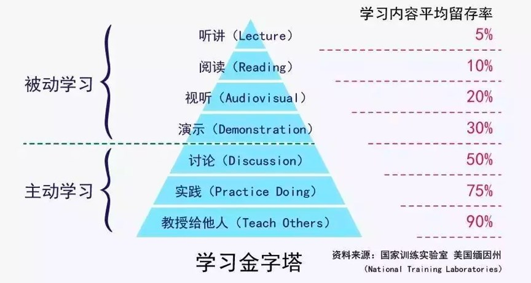

#### 端正学习态度
如果你去研究一下古今中外的成功人士，就会发现，他们基本上都是非常自律的，也都是非常热爱学习的。他们可以沉得下心来不断地学习，在学习中不断地思考、探索和实践。
- 被动学习：如听讲、阅读、试听、演示，学习内容的平均留存率为 5%、10%、20% 和 30%。
- 主动学习：如通过讨论、实践、教授给他人，会将原来被动学习的内容留存率从 5% 提升到 50%、75% 和 90%。

浅度学习和深度学习
- 知识采集。信息源是非常重要的，获取信息源头、破解表面信息的内在本质、多方数据印证，是这个步骤的关键。
- 知识缝合。所谓缝合就是把信息组织起来，成为结构体的知识。这里，连接记忆，逻辑推理，知识梳理是很重要的三部分。
- 技能转换。通过举一反三、实践和练习，以及传授教导，把知识转化成自己的技能。这种技能可以让你进入更高的阶层。

- 学习是为了找到方法
- 学习是为了找到原理
- 学习是为了了解自己
- 学习是为了改变自己

#### 源头、原理和知识地图
- 注重基础和原理。最最关键的是，这些基础知识和原理性的东西和技术，都是经历过长时间的考验的，所以，这些基础技术也有很多人类历史上的智慧结晶，会给你很多启示和帮助。比如：TCP 协议的状态机，可以让你明白，如果你要设计一个异步通信协议，状态机是一件多么重要的事，还有 TCP 拥塞控制中的方式，让你知道，设计一个以响应时间来限流的中件间是什么样的。
- 使用知识图。通过“顺藤摸瓜”的方式，从知识树的主干开始做广度或是深度遍历，于是我就得到了一整棵的知识树。这种“顺藤摸瓜”的记忆方式让我记住了很多知识。最重要的是，当出现一些我不知道的知识点时，我就会往这棵知识树上挂，而这样一来，也使得我的学习更为系统和全面。

#### 深度，归纳和坚持实践
- 系统地学习
  - 这个技术出现的背景、初衷和要达到什么样的目标或是要解决什么样的问题。
  - 这个技术的优势和劣势分别是什么，或者说，这个技术的 trade-off 是什么。
  - 这个技术适用的场景。所谓场景一般分别两个，一个是业务场景，一个是技术场景。
  - 技术的组成部分和关键点。
  - 技术的底层原理和关键实现。
  - 已有的实现和它之间的对比。
- 举一反三
  - 联想能力。这种能力的锻炼需要你平时就在不停地思考同一个事物的不同的用法，或是联想与之有关的别的事物。对于软件开发和技术学习也一样。
  - 抽象能力。抽象能力是举一反三的基本技能。平时你解决问题的时候，如果你能对这个问题进行抽象，你就可以获得更多的表现形式。
  - 自省能力。所谓自省能力就是自己找自己的难看。当你得到一个解的时候，要站在自己的对立面来找这个解的漏洞。
  - 例如
    - 对于一个场景，制造出各种不同的问题或难题。
    - 对于一个问题，努力寻找尽可能多的解，并比较这些解的优劣。
    - 对于一个解，努力寻找各种不同的测试案例，以图让其健壮。
- 总结和归纳
  - 把你看到和学习到的信息，归整好，排列好，关联好，总之把信息碎片给结构化掉，然后在结构化的信息中，找到规律，找到相通之处，找到共同之处，进行简化、归纳和总结，最终形成一种套路，一种模式，一种通用方法。
  - 对自己的知识进行总结和归纳是提高学习能力的一个非常重要的手段。这是把一个复杂问题用简单的语言来描述的能力。
  - 学习的开始阶段，可以不急于总结归纳，不急于下判断，做结论，而应该保留部分知识的不确定性，保持对知识的开放状态。
- 实践出真知
  - 实践出真知也就是英文中的 Eat your own dog food
  - 那些大公司里的开发人员，写完代码，自己不测试，自己也不运维，我实在不知道他们怎么可能明白什么是好的设计，好的软件？
- 坚持不懈

#### 如何学习和阅读代码
书和文档是人对人说的话，代码是人对机器说的话（注：代码中有一部份逻辑是控制流程的逻辑，不是业务逻辑）。所以，
- 如果你想知道人为什么要这么搞，那么应该去看书（像 Effective C++、Code Complete、Design Pattern、Thinking in Java 等），看文档。
- 如果你要知道让机器干了什么？那你应该看代码！（就像 Linus 去看 zlib 的代码来找性能问题。）

读代码的前提
- 相关的语言和基础技术的知识。
- 软件功能。你先要知道这个软件完成的是什么样的功能，有哪些特性，哪些配置项。你先要读一遍用户手册，然后让软件跑起来。
- 相关文档。读一下相关的内部文档，Readme 也好，Release Notes 也好，Design 也好，Wiki 也好。
- 代码的组织结构。也就是代码目录中每个目录是什么样的功能，每个文档是干什么的。

阅读代码的方法
- 一般采用自顶向下，从总体到细节的“剥洋葱皮”的读法。
- 画图是必要的，程序流程图，调用时序图，模块组织图……
- 代码逻辑归一下类，排除杂音，主要逻辑才会更清楚。
- debug 跟踪一下代码是了解代码在执行中发生了什么的最好方式。

了解这个软件的代码的构成
- 接口抽象定义
- 模块粘合层
- 业务流程
- 具体实现
  - 代码逻辑
  - 出错处理
  - 数据处理
  - 重要的算法
  - 底层交互
- 运行时调试

#### 面对枯燥和量大的知识
- 认真阅读文档

小技巧
- 用不同的方式来学习同一个东西。比如：通过看书，听课，创建脑图，写博客，讲课，解决实际问题，等等。
- 总结压缩信息。当你获得太多的信息时，你需要有一个“压缩算法”。
- 把未知关联到已知。把你新学的知识点关联到已知的事物上来。比如，你在学习 Go 语言，你就把一些知识关联到自己已经学过的语言上比如 C 和 Java。通过类比，你会学得更扎实，也会思考得更多。
- 用教的方式来学习。你想想，如果你过几天要在公开场合对很多人讲一个技术，那么这个压力会让你学得更好。
- 学以致用。把学到的东西用起来，没有什么比用起来能让你的知识更巩固的了。在实践中，你才会有更为真实的体会，你才会遇到非常细节和非常具体的问题，这些都会让你重新思考，或深化学习。
- 不要记忆。聪明的人不会记忆知识的，他们会找方法，那些可以推导出知识或答案的方法。这也是为什么外国人特别喜欢方法论。
- 多犯错误。犯错会让你学得到更多，通过错误总结教训，你会比没有犯过错的人体会得更深。但是千万不要犯低级错误，也不要同一个错误犯两次。
