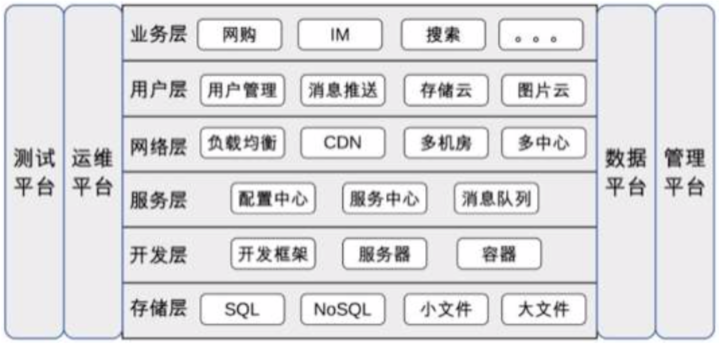

## 38 架构师应该如何判断技术演进的方向？
- 技术流派
  - 潮流派：热衷新技术，紧跟技术潮流
    - 采坑的小白鼠
    - 新技术的学习成本
  - 保守派：对新技术抱有很强的戒心
    - 不能享受新技术的收益
  - 跟风派：跟着竞争对手的步子走
- 技术演进的动力
  - 产品类，技术创新推动业务发展
  - 服务类，业务发展推动技术发展
- 技术演进的模式
  - 功能复杂度、规模复杂度
  - 不同阶段不一样

## 39 互联网技术演进的模式
业务发展：复杂性和用户规模
1. 初创期
  - 快实现
1. 发展期
   - 堆功能期
   - 优化期
     - 优化派：重构、分层、优化，小调整、快速
     - 架构派：将大系统拆分为小系统，动作大，周期长
   - 架构期：拆功能、拆数据库、拆服务器
1. 竞争期
   - 重复造轮子
   - 系统交互一团麻
   - 解决方案
     - 平台化：数据化平台，存储平台，缓存平台
     - 服务化：消息队列，服务框架
1. 成熟期
   - 性能
   - 可用性

## 40 互联网架构模板：存储层技术

- SQL：Mysql、PG、Oracle
- NoSQL：memchache、redis
- 小文件存储：淘宝的 TFS、京东的 JFS、Facebook 的 Haystack
- 大文件存储：Bigtable/Map-Reduce/GFS、HDFS、HBase、Storm、Hive

## 41 互联网架构模板：开发层和服务层技术
- 开发层
  - 开发框架：SSH、SpringMVC、Ruby on Rails、ThinkPHP、Django
  - web 服务器：Tomcat、JBoss、Resin、Nginx、Apache
  - 容器技术：Docker
- 服务层
  - 配置中心
  - 服务中心
    - 服务名字系统（Service Name System）
    - 服务总线系统（Service Bus System）
- 消息队列

## 42 互联网架构模板：网络层技术
站在全公司的整体角度看系统
- 负载均衡
  - DNS
    - HTTP-DNS 主要用在 app 提供的服务上
  - Nginx（5万）、LVS（数10万）、F5（200万~800万）
  - CDN
  - 多机房
  - 多中心

## 43 互联网架构模板：用户层和业务层技术
- 用户层
   - 用户管理
     - 单点登录 SSO，使用 cookie、JSONP、token 等实现，最成熟的方案 CAS
     - 授权登录：OAuth2
   - 消息推送
     - 短信、邮件、站内信、App推送
     - iOS：APNS，Android的五花八门
     - 实现要点：设备管理（唯一标识、注册、注销），连接管理和消息管理
     - 技术挑战：海量设备和用户管理，连接保活（应用互相拉起，手机厂商开白名单），消息管理
   - 存储云、云图片
- 业务层
   - 复杂度提升：拆
   - 分久必合
     - 原则：高内聚，低耦合
     - Facade 模式

## 44 互联网架构模板：平台技术
- 运维平台
  - 功能：配置、部署、监控、应急
  - 要素：标准化、平台化、自动化、可视化
- 测试平台
  - 单元测试、集成测试、接口测试、性能测试
  - 用例管理、资源管理、任务管理、数据管理
- 数据平台
  - 数据管理：采集、存储、访问、安全
  - 数据分析：数据挖掘、机器学习、深度学习
  - 数据应用
- 管理平台
   - 核心职责：权限管理
     - 身份认证
     - 权限控制

## 45 架构重构内功心法第一式：有的放矢
- 识别出需要用架构重构来解决的问题，不要想解决所有问题
- 架构重构 vs 系统优化：如果从0开始设计一个系统，和老架构是否相似？差异大，架构重构

## 46 架构重构内功心法第二式：合纵连横
- 合纵：用大家（业务人员，产品人员）能听懂的语言沟通，达成一致，少说技术术语
- 连横：站在对方（兄弟组）的角度，换位思考

## 47 架构重构内功心法第三式：运筹帷幄
分段实施，将要解决的问题根据优先级、重要性、实施难度划分为不同的阶段，每个阶段聚焦于一个整体的目标，集中精力和资源解决一类问题。
1. 优先级排序
1. 问题分类
1. 先易后难（团队士气、相关人员评估、判断可能出错）
1. 循序渐进（一个阶段不要超过3个月）

## 48 再谈开源项目：如何选择、使用以及二次开发
DRY：Donot repeat yourself.
灾难性的事故全是数据丢失
- 如何选择一个开源项目
  - 聚焦是否满足业务：合适原则、演化原则
  - 聚焦是否成熟：版本高，使用公司数量，社区活跃度
  - 聚焦运维能力：日志是否齐全、维护工具、故障检测和恢复能力
- 如何使用开源项目
  - 深入研究，仔细测试
  - 小心应用，灰度发布
  - 做好应急，以防万一
- 如何基于开源项目做二次开发
  - 保持纯洁，加以包装：不要私下改代码
  - 发明你的轮子

## 49 谈谈 App 架构的演进
- Web App：快速开发、低成本
- 原生 App：用户体验
- Hybrid App
- 组件化 & 容器化
- 跨平台 App

## 50  架构实战：架构设计文档模板
首先根据《备选方案模板》选择一个方案落地，《架构设计文档》用来详细描述细化方案的备选方案模板
1. 需求介绍
   - 背景、目标、范围
1. 需求分析
   - 全方位地描述相关信息
   - 5W
     - who：需求利益干系人，包括开发者、使用者、购买者、决策者
     - when：需求使用时间，包括季节、时间、里程碑等
     - what：需求的产出是什么，包括系统、数据、文件、开发库、平台等
     - where：需求的应用场景，包括国家、地点、环境等，例如只在测试环境部署
     - why：需求需要解决的问题，通常和需求背景相关
   - 1H
     - how：方案的关键流程
   - 8C
     - 性能 performance
     - 成本 cost
     - 时间 time
     - 可靠性 reliability
     - 安全性 security 
     - 合规性 compliance
     - 技术性 technology
     - 兼容性 compatibility
1. 复杂度分析
   - 高可用
   - 高性能
   - 可扩展
1. 备选方案
   - 至少三个备选方案
   - 关键实现的描述，无需细节描述

架构模板
1. 总体方案
   - 架构图
   - 模块、子系统、核心流程图
1. 架构总览
   - 架构图
   - 架构的描述
1. 核心流程
   - 举例：消息发送，消息读取
1. 详细设计
   - 高可用设计：消息可靠性（发送、存储、读取）
   - 高性能设计
   - 可扩展设计：如不涉及写无
   - 安全设计：身份识别、权限控制
   - 其他设计：开发语言等待
   - 部署方案：硬件要求、服务器部署方式、组网方式
1. 架构演进规划
   - 第一期
   - 第二期
   - 第三期
