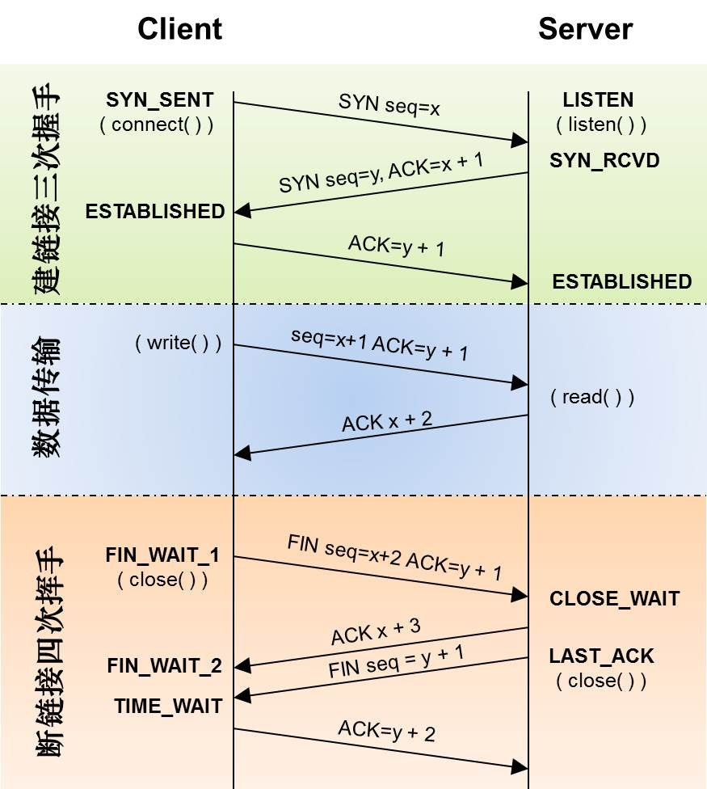
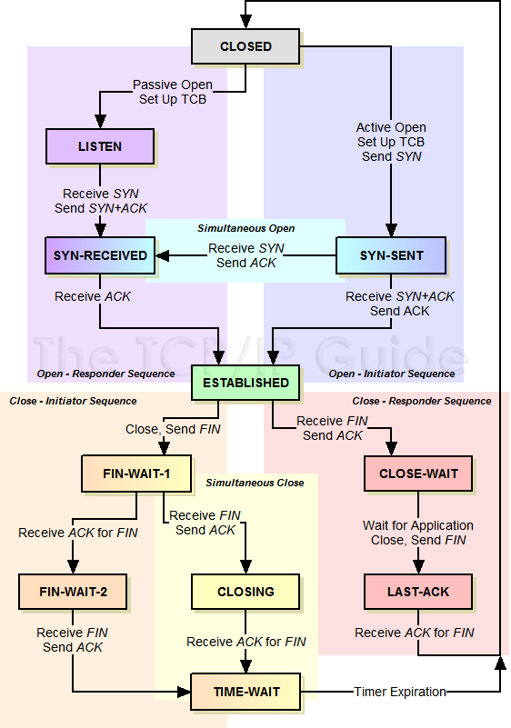
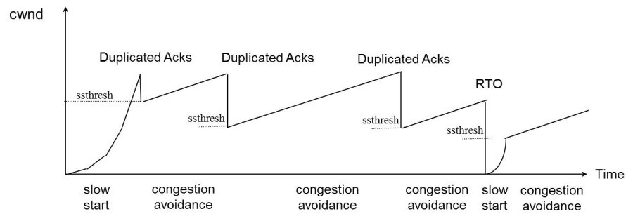

# TCP 小结

## TCP状态迁移图

 

## SYN Flood攻击
新建连接时，如果server端收到client的SYN包后回复了SYN/ACK，但client掉线了，server端没收到client的ACK，这个连接处于一个中间状态，即没成功，也没失败。于是，server端如果在一定时间内没有收到ACK的TCP会重发SYN-ACK。在Linux下，默认重试次数为5次，重试的间隔时间从1s开始每次都翻售，5次的重试时间间隔为1s, 2s, 4s, 8s, 16s，总共31s，第5次发出后还要等32s都知道第5次也超时了，所以，总共需要 1s + 2s + 4s+ 8s+ 16s + 32s = 2^6 -1 = 63s，TCP才会把断开这个连接。
一些恶意的人就为此制造了SYN Flood攻击——给服务器发了一个SYN后，就下线了，于是服务器需要默认等63s才会断开连接，这样，攻击者就可以把服务器的syn连接的队列耗尽，让正常的连接请求不能处理。于是，Linux下给了一个叫tcp_syncookies的参数来应对这个事——当SYN队列满了后，TCP会通过源地址端口、目标地址端口和时间戳打造出一个特别的Sequence Number发回去（又叫cookie），如果是攻击者则不会有响应，如果是正常连接，则会把这个 SYN Cookie发回来，然后服务端可以通过cookie建连接（即使你不在SYN队列中）。
请注意，请先千万别用tcp_syncookies来处理正常的大负载的连接的情况。因为，synccookies是妥协版的TCP协议，并不严谨。对于正常的请求，你应该调整三个TCP参数可供你选择，第一个是：tcp_synack_retries 可以用他来减少重试次数；第二个是：tcp_max_syn_backlog，可以增大SYN连接数；第三个是：tcp_abort_on_overflow 处理不过来干脆就直接拒绝连接了。

## 关于MSL和TIME_WAIT
MSL 是Maximum Segment Lifetime英文的缩写，中文可以译为“报文最大生存时间”，他是任何报文在网络上存在的最长时间，超过这个时间报文将被丢弃。
从TIME_WAIT状态到CLOSED状态，有一个超时设置，这个超时设置是 2*MSL（RFC793定义了MSL为2分钟，Linux设置成了30s）为什么要这有TIME_WAIT？为什么不直接给转成CLOSED状态呢？主要有两个原因：1）TIME_WAIT（收到了对方发来的FIN，发送了ACK）确保有足够的时间让对端收到了ACK，如果被动关闭的那方没有收到ACK，就会触发被动端重发FIN，一来一去正好2个MSL，2）有足够的时间让这个连接不会跟后面的连接混在一起（有些自做主张的路由器会缓存IP数据包，如果连接被重用了，那么这些延迟收到的包就有可能会跟新连接混在一起）。
关于TIME_WAIT数量太多。从上面的描述我们可以知道，TIME_WAIT是个很重要的状态，但是如果在大并发的短链接下，TIME_WAIT就会太多，这也会消耗很多系统资源。处理方式都是教你设置两个参数，一个叫`tcp_tw_reuse`，另一个叫`tcp_tw_recycle`的参数，这两个参数默认值都是被关闭的，后者recyle比前者resue更为激进，resue要温柔一些。另外，如果使用tcp_tw_reuse，必需设置`tcp_timestamps=1`，否则无效。这里，你一定要注意，打开这两个参数会有比较大的坑——可能会让TCP连接出一些诡异的问题（因为如上述一样，如果不等待超时重用连接的话，新的连接可能会建不上。正如官方文档上说的一样“It should not be changed without advice/request of technical experts”）。

## 拥塞控制
拥塞控制主要是四个算法：
- 慢热启动算法 – Slow Start
- 拥塞避免算法 – Congestion Avoidance
- 拥塞状态时的算法
- 快速恢复算法 – Fast Recovery

## 重传
快速重传机制 于是，TCP引入了一种叫Fast Retransmit 的算法，不以时间驱动，而以数据驱动重传。也就是说，如果，包没有连续到达，就ack最后那个可能被丢了的包，如果发送方连续收到3次相同的ack，就重传。Fast Retransmit的好处是不用等timeout了再重传。

SACK 方法 另外一种更好的方式叫：Selective Acknowledgment (SACK)（参看RFC 2018），这种方式需要在TCP头里加一个SACK的东西，ACK还是Fast Retransmit的ACK，SACK则是汇报收到的数据碎版。参看下图：(更详细的确认ack)

## 信号处理
在网络编程中，SIGPIPE这个信号是很常见的。当往一个写端关闭的管道或socket连接中连续写入数据时会引发SIGPIPE信号，引发SIGPIPE信号的写操作将设置errno为EPIPE。
在TCP通信中，当通信的双方中的一方close一个连接时，若另一方接着发数据，根据TCP协议的规定，会收到一个RST响应报文，若再往这个服务器发送数据时，系统会发出一个SIGPIPE信号给进程，告诉进程这个连接已经断开了，不能再写入数据。
